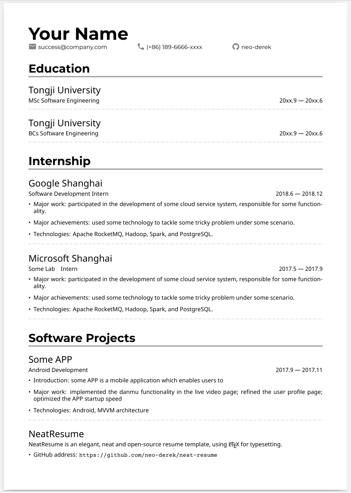
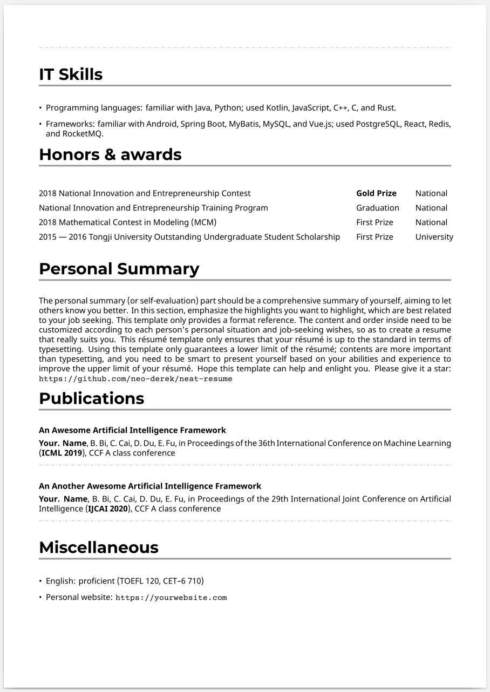
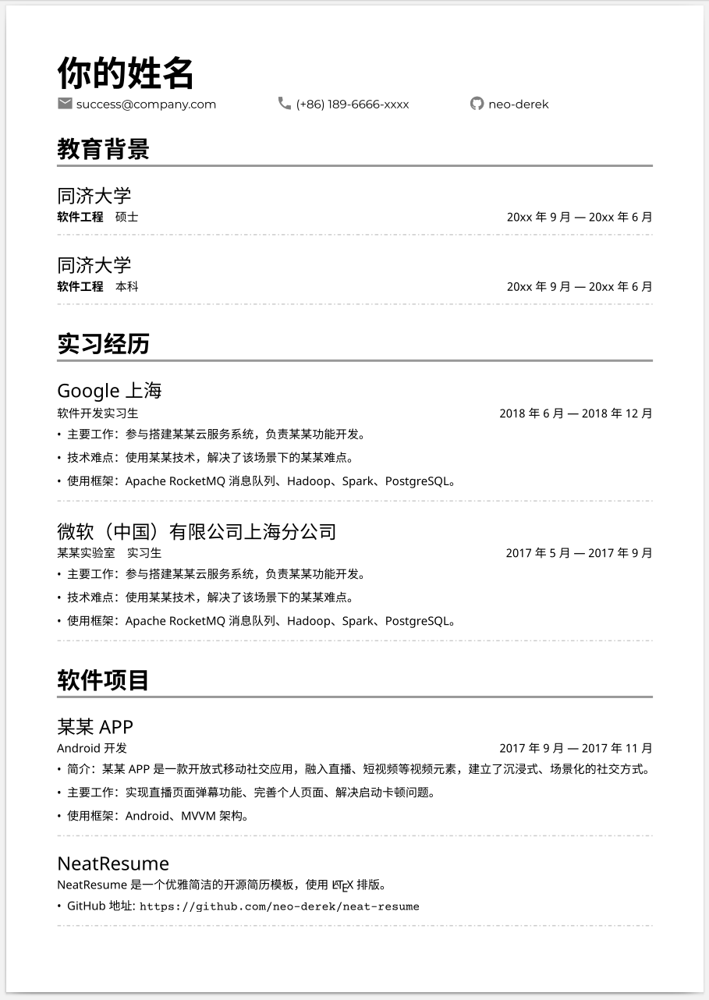
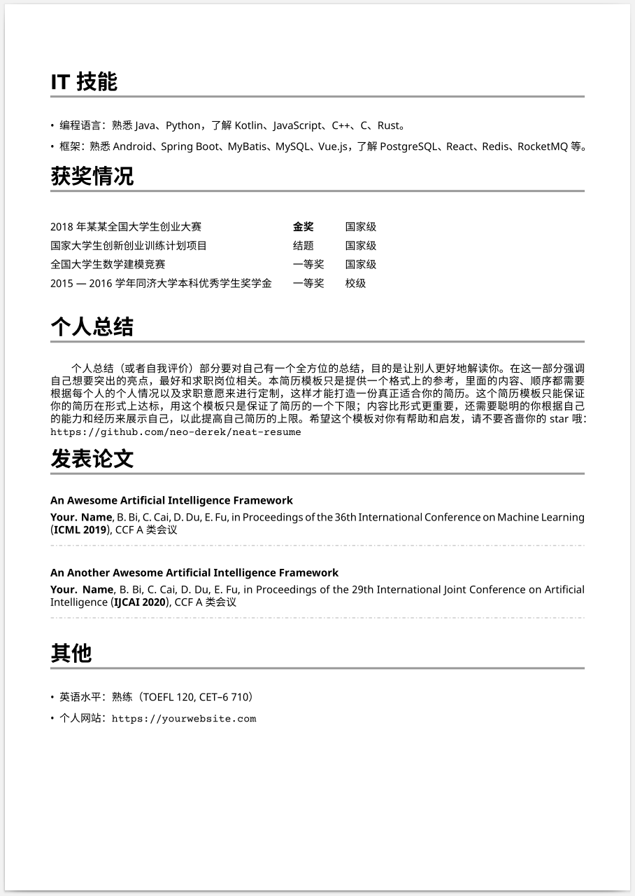

# Neat Résumé

A neat résumé template made with LaTeX.

[中文版请戳这里](./README_zh.md)

**Please star :star: this repository if you like this template :heartbeat:**

## Examples

This is an example résumé for a typical graduate. :construction_worker:

**English version**





**Chinese version**





## Usage

**Edit `./resume/en/resume_en.tex` and `./resume/zh/resume_zh.tex` and compile with `xelatex`.**

Following are two methods for you to prepare your awesome résumé.

### Method 1: Local Compilation

### Method 2: Overleaf

Under construction. Currently read-only.

[Overleaf](https://www.overleaf.com/read/qwhqxjyzsxjr)

## License

```
Copyright 2020 Jianfeng Hou <frankderekdick@gmail.com>

Licensed under the Apache License, Version 2.0 (the "License");
you may not use this file except in compliance with the License.
You may obtain a copy of the License at

    http://www.apache.org/licenses/LICENSE-2.0

Unless required by applicable law or agreed to in writing, software
distributed under the License is distributed on an "AS IS" BASIS,
WITHOUT WARRANTIES OR CONDITIONS OF ANY KIND, either express or implied.
See the License for the specific language governing permissions and
limitations under the License.
```
