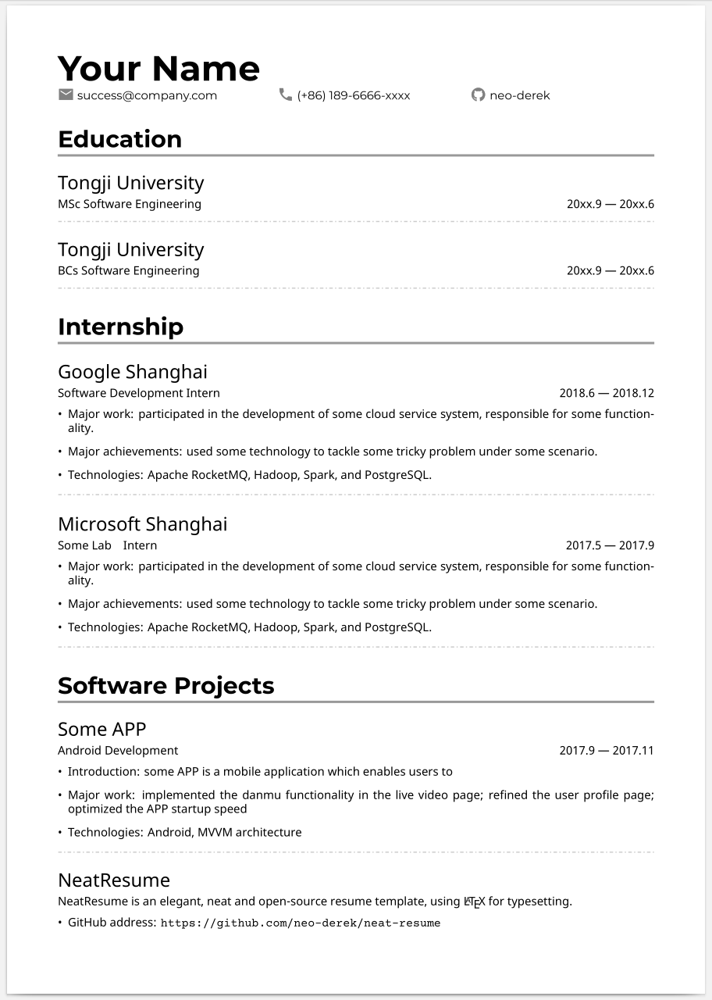
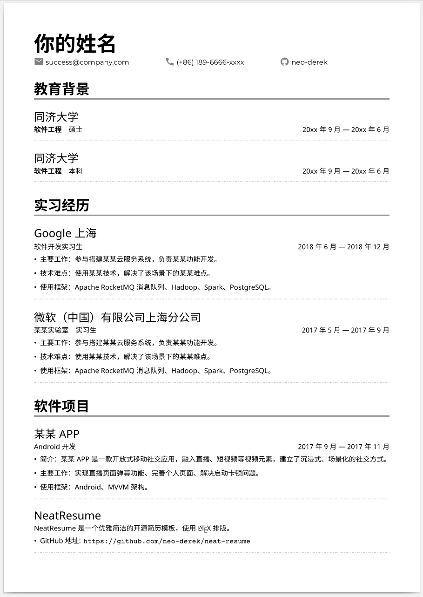

# Neat Résumé

一个简洁优雅的开源简历模板，使用 LaTeX 排版。

[English version](./README.md)

**如果你喜欢这个模板 :heartbeat:，请点击右上角的 star :star:**

## 样例

下面是一个典型毕业生的样例简历。:construction_worker:

**英文版**




**中文版**




## 使用

你可以使用以下两种方式来准备你精美的简历。

### 方法一：本地编译

### 方法二：Overleaf

## 许可

```
Copyright 2020 Jianfeng Hou <frankderekdick@gmail.com>

Licensed under the Apache License, Version 2.0 (the "License");
you may not use this file except in compliance with the License.
You may obtain a copy of the License at

    http://www.apache.org/licenses/LICENSE-2.0

Unless required by applicable law or agreed to in writing, software
distributed under the License is distributed on an "AS IS" BASIS,
WITHOUT WARRANTIES OR CONDITIONS OF ANY KIND, either express or implied.
See the License for the specific language governing permissions and
limitations under the License.
```
